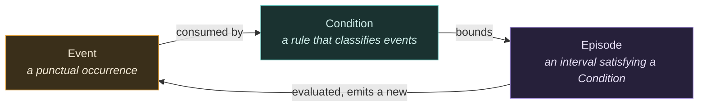
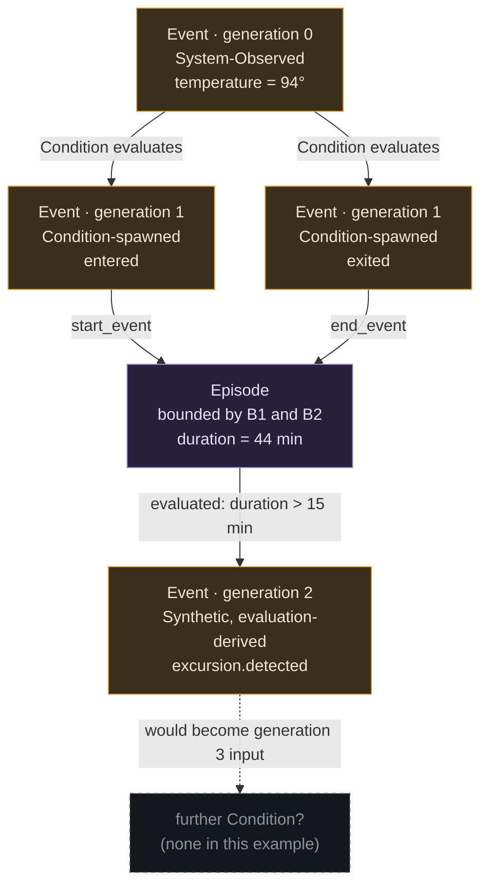
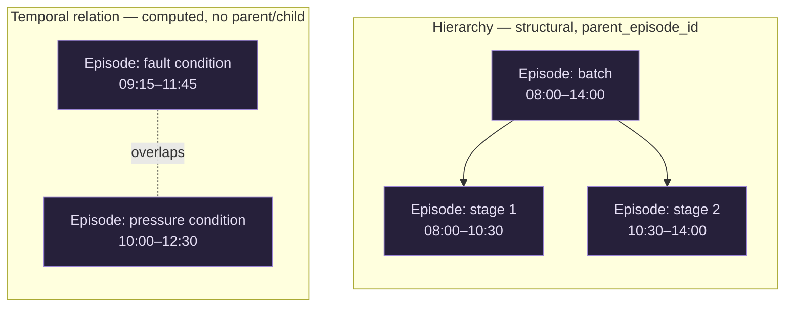
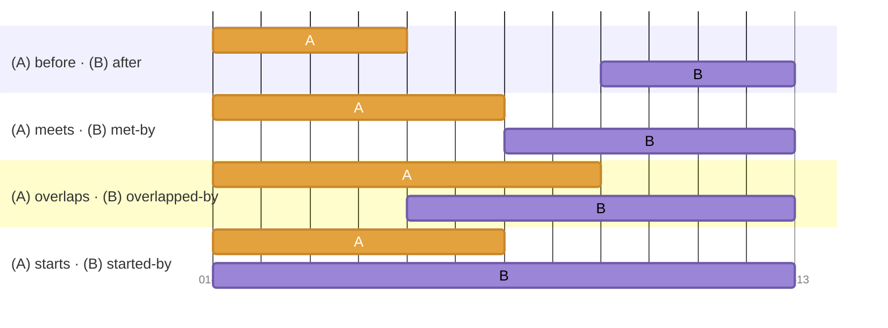
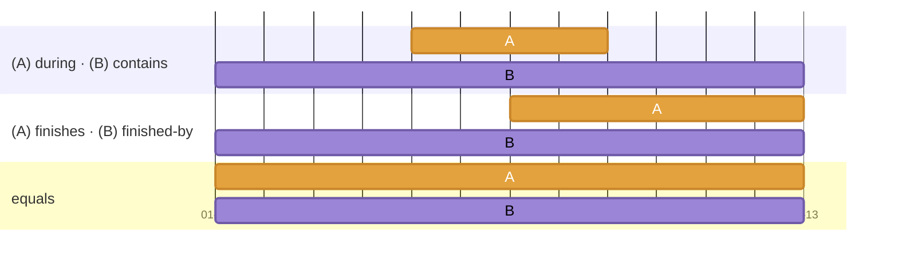
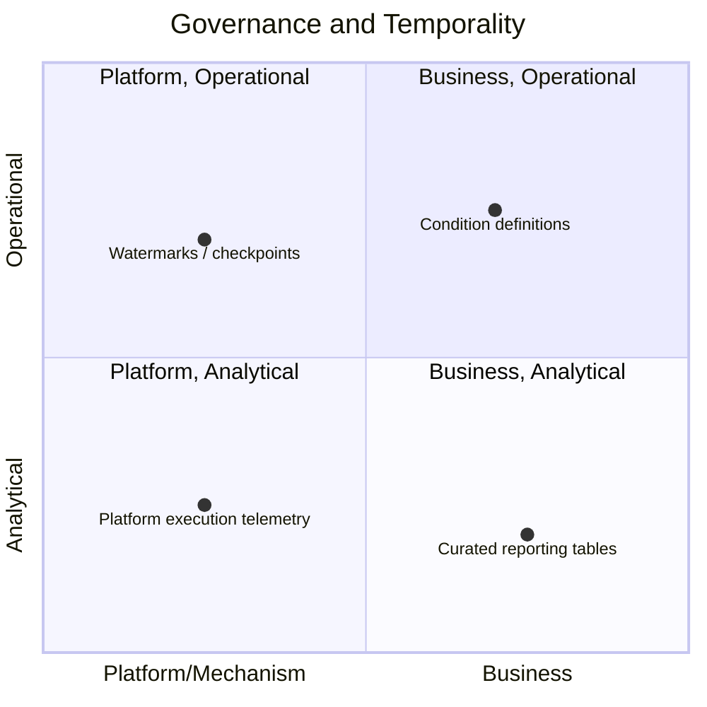

# Event, Condition, Episode: A General Ontology for Temporal Reasoning

**Jason Dossett**<br>
*SEP*<br>
*jtdossett@sep.com*

---

**Abstract**—This paper presents a minimal, implementation-agnostic ontology
for reasoning about time-bounded occurrences and the rules that give them
meaning. The model resolves three recurring questions in systems that reason
over intervals rather than only point-in-time facts: what is the smallest
set of categories needed to separate a fact, a classifying rule, and a
bounded period into which the rule applies, without collapsing any two of
them into one; how a system avoids an unbounded chain of derived facts
triggering further derivations indefinitely; and where the boundary lies
between a generic, reusable primitive and a business-specific, curated
result. Three categories — Event, Condition, and Episode — and two
independent axes on Events — Provenance and Generation — are defined,
together with a boundedness argument based on acyclic dependency graphs. The
model further distinguishes structural Hierarchy from computed Temporal
Relations between Episodes, adopting Allen's interval algebra for the
latter, and defines a mechanical test for the boundary between the model and
curated business artifacts.

**Index Terms**—event-driven systems, temporal reasoning, ontology, interval
algebra, complex event processing, event sourcing, episode segmentation.

---

## I. Introduction

This paper describes a small, general-purpose ontology for reasoning about
time-bounded occurrences and the rules that give them meaning. It is
deliberately **implementation-agnostic** — no framework, decorator syntax,
or storage schema is assumed.

The model exists to answer three recurring questions in any system that
needs to reason about intervals rather than only point-in-time facts:

1. What is the smallest set of categories that can express "something
   happened," "here's a rule for classifying what happened," and "here's a
   bounded period during which that rule held," without collapsing any two
   of them into one?
2. How does a system avoid an unbounded chain of derived facts triggering
   more derived facts, forever?
3. Where is the line between a generic, reusable primitive and a
   business-specific, curated result — and is that line about naming, or
   about something checkable?

## II. The Three Categories

Everything in this model is one of exactly three things (Fig. 1).



*Fig. 1. The three fundamental categories of the ontology and the cycle by
which each produces the next.*

### A. Event

A punctual occurrence — something that happened at a specific instant. An
Event is a fact, not an interpretation of a fact.

### B. Condition

A rule that classifies a stream of Events. A Condition is the thing that
gives an interval meaning — it is the "why," not the "when." Condition
content (a threshold, a pattern, a comparison) is business-authored: someone
chose it deliberately, using domain judgment, and can reasonably revise it
later based on that same judgment. A processing checkpoint or cursor has no
equivalent — there's no domain judgment to exercise over what its value
should be, because it carries no business content at all. That's the
distinction that matters, not how the two happen to be stored.

### C. Episode

An **Interval** — a bounded span of time, with a start and an end, bounded
by two Events — that satisfies a Condition. An Episode is **not** a kind of
Event, and it is not merely an Interval either: it is the fusion of an
Interval and the Condition that classifies it.

The Interval by itself, with no Condition attached, is a real and useful
concept, not something this model discards — it's what Allen's interval
algebra operates on (see Section VII), and it's what a native segmentation
source (a batch ID's start/end, a changepoint detector's boundary) hands you
before any Condition has been attached to it (see Section V). It just isn't
an Episode until a Condition is attached — an Interval is the "when," an
Episode is the "when" fused with the "why." (This is the "Descriptions and
Situations" pattern from foundational ontology work [1].)

## III. Two Independent Axes on Events

Not every Event is the same kind of fact. Two axes distinguish them, and
critically, **neither implies the other**.

### A. Provenance: Where Did This Fact Come From?

- **System-Observed** — emitted natively by some system: a sensor, an API, a
  file landing process, another platform's own event stream.
- **Synthetic** — computed by this model's own reasoning, not observed
  directly. Subdivides by *how* it was computed:
  - **Condition-spawned** — the boundary of a Condition becoming or ceasing
    to be true.
  - **Aggregation-derived** — computed from a windowed aggregate.
  - **Correlation-derived** — computed by joining multiple subjects or
    streams.
  - **Inference-derived** — computed by a model or scorer rather than a
    deterministic rule.

### B. Generation: How Many Derivation Hops Separate This Event from an Observation?

```text
generation(System-Observed event) = 0                                   (1)
generation(Synthetic event)        = 1 + max(generation of every Event
                                               consumed by the Condition
                                               that produced it)         (2)
```

A System-Observed Event is always generation 0. A Synthetic Event's
generation is always at least 1, and strictly greater than everything it was
derived from — generation only ever increases along a derivation chain,
never resets or loops backward. This is what makes the model's recursion
terminate (see Section VIII) without needing to track anything more complex
than an integer.

### C. Independence of the Two Axes

**Why these axes are independent, not one axis in disguise:** a
System-Observed Event can already be business-meaningful (a source system
might emit a well-named business fact directly); a Condition-spawned
Synthetic Event can still be low-level and generic (`value_changed`). How
"derived" something is says nothing about how meaningful it is — treating
them as the same axis is a common conflation this model deliberately avoids.

## IV. A Worked Example



*Fig. 2. A three-generation derivation chain from a raw observation to a
synthetic, evaluation-derived Event.*

The chain stops the moment nothing consumes the highest-generation Event
produced so far. Nothing in the model requires it to stop — if a further
Condition existed watching for `excursion.detected`, the chain would
continue at generation 3, and the same structure (Event → Condition →
Episode → Event) would repeat one level up.

## V. Provenance of Episode Boundaries

The worked example in Section IV derives both boundary Events from a
Condition evaluating raw signal — but that is not the only legitimate source
of an Episode's boundaries, and it is often not the best one.

**When a source system already assigns a discrete grouping key, use that key
directly instead of reconstructing the Interval from timestamps.** A batch
ID, run ID, record number, or step number gives exact, unambiguous interval
membership — a row either carries `batch_id = X` or it doesn't. Inferring
the same membership from a timestamp range has to get several genuinely
hard things right instead: whether a reading exactly at the boundary is in
or out, clock skew between whatever system stamped the reading and whatever
system defines the interval, out-of-order or late arrival, and rows that
happen to share a timestamp at the resolution available. A discrete key
sidesteps all of that — it isn't a question of better ground truth so much
as a completely different, non-fuzzy kind of test replacing a fundamentally
boundary-sensitive one. In this model, that case is simply a
System-Observed boundary pair (`batch.started`/`batch.ended`, generation 0
on both ends), with the Condition doing little more than grouping by the key
itself — not a special case, and not a reason to invent a second kind of
Episode. The Condition can be close to trivial ("same `batch_id`") precisely
because the source already solved the hard part; timestamp-range membership
is what's being avoided, not merely improved on.

**Other segmentation mechanisms map onto the existing provenance categories
rather than needing new ones:**

- A condition that toggles on and off (gaps-and-islands: turning a stream of
  state changes into runs of consecutive same-state observations) is the
  Condition-spawned case already described in Section III-A.
- A continuous signal with no discrete triggers, segmented by a changepoint
  or regime detector, is a concrete instance of an **Inference-derived**
  Event (see Section III-A) — the boundary comes from a model's output, not
  an expression, which is exactly the distinction that provenance category
  exists to name.
- A procedural decomposition (a manufacturing batch's stages and steps, or a
  process reconstructed from an event log) is a case of **Hierarchy**
  between Episodes — see Section VII — rather than a new kind of boundary
  detection.

Different detectors can run over the same underlying series and produce
different, overlapping sets of Episodes without conflicting, because nothing
in this model assumes there is only one valid way to carve up a timeline —
the same reasoning applies below to multiple Conditions independently
classifying the same interval.

## VI. Episodes Versus Episode-Determination Events

An Episode is not itself an Event. An **Episode-determination Event** is a
punctual fact *about* an Episode: the system determined that an Episode
opened, closed, expired, was superseded, or otherwise changed lifecycle
state. That determination Event is a first-class Event and can be consumed
by later Conditions like any other Event. It is not a substitute for the
materialized Episode row it announces.

Two Events with the same start and end timestamps can still be two entirely
different Episodes, if two different Conditions independently classify the
same underlying interval. `temperature > 90` and `temperature > 90 AND
humidity > 80` can both be true over the exact same window on the same
subject — that's two Episodes, not one Episode observed twice, because an
Episode's identity includes *which Condition* is doing the classifying, not
just the interval's boundaries.

This has a direct, practical consequence for anything implementing this
model: an Episode needs a **stable identity independent of its boundaries**,
because:

- an Episode can be **open** (no end Event yet) — there's nothing to compute
  a bare interval from until it closes, but the Episode already exists as a
  tracked, addressable thing;
- an Episode can be **revised in place** — a provisional close (an
  expiration, in the absence of a real end Event within an expected window)
  can later be superseded by a real end Event, and anything that already
  referenced the Episode needs that reference to remain valid across the
  correction;
- other things need to **point at** a specific Episode (an evaluation
  result, a downstream record) — which requires an identity that survives
  regardless of whether the interval's boundaries are still being computed.

A live, on-demand computation over the raw Events (a join or a view) cannot
provide any of these three properties, because it recomputes from nothing on
every access and has no persisted identity between accesses. This is the
core argument for why any real implementation of this model materializes
Episodes rather than treating them as a derived, on-the-fly query.

## VII. Relationships Between Episodes

Everything in Sections II–VI describes a single Episode's relationship to
its own boundary Events. Real processes also need to relate *Episodes to
other Episodes* — and there are two structurally different relationships
hiding under words like "inside" or "nested," which must not be conflated
(Fig. 3).



*Fig. 3. Structural Hierarchy (left) contrasted with a computed Temporal
Relation (right). The two must not be conflated.*

### A. Hierarchy

Hierarchy is a **structural** claim: this Episode is part of that Episode,
by process decomposition — a batch containing stages, a stage containing
steps. It's expressed with a single self-reference, `parent_episode_id`, on
the Episode itself. Depth needs no separate vocabulary of type names: an
Episode three levels deep is still just an Episode row whose
`parent_episode_id` points at another Episode row, which points at another.
Sibling Episodes under the same parent should not overlap each other, and
duration/count rollups at any level are aggregates over that level's
children when the hierarchy is symmetrical. This is the same shape a
manufacturing batch process has, and the same shape process mining assumes
when it reconstructs cases and activities from an event log — both are
examples of *how* a hierarchy gets established, not a different kind of
relationship once established.

Hierarchy is independent of generation (see Section III): a parent Episode
and its child can be produced by Conditions at the same generation or
different ones. Nesting is a separate axis from derivation depth, and
neither predicts the other.

### B. Temporal Relations

Two Episodes can also relate purely by *when* they occurred — that is,
purely by comparing their underlying Intervals, with no structural
relationship between the Episodes themselves at all. A fault condition's
Episode and a pressure condition's Episode might overlap in time without
either containing, causing, or being part of the other. **This must not be
modeled as hierarchy.** An Episode whose Interval happens to fall entirely
inside another Episode's Interval is not that Episode's child — collapsing
"temporally nested" into `parent_episode_id` smuggles in a structural claim
that isn't true, and it costs you the ability to query the two relationships
independently later, exactly when a question spans both ("how much of stage
2 was spent inside a fault condition" is a join between a hierarchy query
and a temporal-relation query — not answerable at all if the fault Episode
was wrongly filed as stage 2's child in the first place).

Rather than inventing an ad hoc vocabulary ("overlapping," "inside,"
"touching") that runs out of precision the moment a real question needs it
("did the fault start before or after the pressure condition it overlaps?"
— "overlapping" alone can't answer that), this model adopts **Allen's
interval algebra** [5], applied to the Interval each Episode carries — a
complete, unambiguous enumeration of every possible way two intervals can
relate in time, with no gaps and a defined inverse for each relation.

All thirteen relations are represented in Figs. 4 and 5 as seven rows — one
row per shape, since a mirror inverse is the same drawing with A and B's
roles swapped, not a new shape. Each row's label names both directions at
once, tagged with which interval the name describes: `(A) before · (B)
after` means "A is before B" and, equivalently, "B is after A." `equals` is
its own inverse, so it only needs one name.

A is always the amber bar, B is always the violet bar in every row below —
the same two colors used for Events and Episodes elsewhere in this
document — so the coloring stays constant and only the bars' positions
change. Real calendar dates, not epoch arithmetic, are used since that's the
standard, well-supported path through Mermaid's Gantt parser rather than an
edge case. The relations are split into two shorter charts — four
relation-pairs, then three — so no single chart has to carry all seven rows,
with extra left padding reserved so the row labels don't run into the bars.



*Fig. 4. Allen's interval algebra, relation-pairs 1–4: before/after,
meets/met-by, overlaps/overlapped-by, starts/started-by.*



*Fig. 5. Allen's interval algebra, relation-pairs 5–7: during/contains,
finishes/finished-by, and equals.*

Table I groups the thirteen relations by kind.

**TABLE I. ALLEN RELATION GROUPS**

| Category | Relations | Description |
|---|---|---|
| Disjoint | `before` / `after` | No shared time at all. |
| Exact-boundary relations | `meets` / `met-by`, `equals` | A clean handoff between two Episodes, or two independent Conditions agreeing on the same interval. |
| Containment without hierarchy | `during` / `contains`, `starts` / `started-by`, `finishes` / `finished-by` | One interval nests inside another with no parent/child relationship existing between them. |
| Partial overlap | `overlaps` / `overlapped-by` | No containment in either direction — exactly what two independently-detected conditions do to each other when neither caused the other. |

In practice, computing which of the thirteen applies is a small, cheap set
of boundary comparisons once a coarse "do these overlap at all" check
passes (`A.start <= B.end AND B.start <= A.end`, under whatever interval
convention is in force) — not thirteen independent checks. That convention
has to be stated explicitly and applied consistently: this model recommends
**half-open intervals** (start inclusive, end exclusive) specifically
because a closed-interval convention leaves exact-boundary cases (`meets`
vs. `overlaps`) ambiguous, which is exactly where double-counting and
misclassification bugs tend to appear.

As with Condition-derived Episodes generally, correlation and causal
inference between related Episodes belong to a later analytical step, not
to the relationship itself — `overlaps` is a temporal fact; "the fault
caused the pressure excursion" is an interpretation of that fact, and
keeping them distinct is the same discipline this model already applies at
the Generic/Curated Boundary (see Section IX).

## VIII. Boundedness

Because a Condition's output can become another Condition's input, the
model supports arbitrarily deep recursion by construction. Two properties
keep that recursion safe rather than open-ended:

1. **The dependency graph between Conditions must be acyclic.** If Condition
   B consumes what Condition A produces, and Condition A (directly or
   transitively) consumes what Condition B produces, the graph has a cycle
   and the model has no defined meaning for it. Any implementation must
   reject this at the point a Condition is defined or changed, not discover
   it at runtime.
2. **Generation is computed from that graph, never assigned by hand.** Given
   an acyclic graph, every Event's generation is fully determined —
   `generation(base) = 0`, `generation(derived) = 1 + max(generation of
   everything it was derived from)`. Because the graph is known and finite
   before anything runs, the total number of generations is known in
   advance; walking all of them in order is a bounded, terminating
   computation, not an open-ended "keep going until nothing changes" loop
   with a data-dependent stopping condition.

Together, these mean recursion in this model is exactly as safe as any other
directed acyclic graph traversal — which is a much weaker, more tractable
claim than "safe because we bounded the iteration count," and it's the
reason the model can support genuinely unbounded-looking recursion (an
Episode-determination Event triggering a new Condition, triggering a new
Episode, indefinitely) without needing a runtime safety valve.

## IX. The Generic/Curated Boundary

Every real system built on this model eventually needs a place where a
generic Episode or Event becomes a specific, named, business artifact — a
report, a dashboard metric, a downstream table with a domain-specific name.
The boundary between "still part of this model" and "now a business
artifact" should be a **mechanical test**, not a naming convention:

> Something is still part of this model if it carries generation/provenance
> information and could still be consumed by a further Condition. Something
> has become a business artifact the moment it's read by an ordinary
> transformation and produced as something with no generation/provenance
> information left on it — regardless of how domain-specific or how generic
> either side's *name* happens to sound.

This boundary is per-consumer, not per-artifact: the same Episode can
simultaneously feed a business-curation step (exiting the model) and a
further Condition (continuing within it). Different consumers decide
independently whether they're exiting the recursive system or continuing
it — an artifact doesn't have to choose one role permanently.

## X. A Second, Independent Lens: Governance and Temporality

Separately from how derived or how business-meaningful something is, two
more questions turn out to matter for how something should be governed and
operated:

- **Is its content business-authored, or purely mechanical/platform state?**
  A Condition's threshold was chosen deliberately, using domain judgment, and
  can be revised later on that same basis. A checkpoint or watermark has no
  equivalent — nobody exercises domain judgment over what a watermark's
  value should be, because it carries no business content to begin with.
- **Does it drive a real-time decision, or inform later analysis?** Some
  data exists to trigger an action right now; other data exists to be
  queried, aggregated, and reported on after the fact.



*Fig. 6. Placement of four representative artifact types on the Governance
× Temporality plane.*

These two questions are independent of each other *and* independent of the
Event/Condition/Episode/generation model of Sections II–VIII — a Condition
sits in the Business × Operational quadrant specifically because its
content is business-authored (unlike a watermark) while still functioning
as configuration consulted by a reasoning engine (unlike a curated report).
That combination is why Condition definitions typically need more
governance (versioned history, an explicit change-review story) than either
pure platform state or ordinary curated data needs on its own — not because
of an arbitrary rule, but because it inherits requirements from both axes at
once.

This lens is useful for reasoning about *why* something needs the
governance it needs. It is not, on its own, a reason to build reserved tags
or enforcement tooling around it — that's a separate decision with its own
cost, to be made only if the need for it is demonstrated repeatedly, not
assumed from the existence of the lens.

## XI. Related Work

This model is not invented from nothing — it is a synthesis of a few
well-established ideas, credited here so the reasoning behind it can be
checked independently:

- **Descriptions and Situations** [1], part of the DOLCE foundational
  ontology, is the formal source for "an Episode is not an Event, it's the
  fusion of an interval and the rule that classifies it." A Description
  (Condition) classifies a Situation (Episode); Events are the Situation's
  boundaries.
- **SOSA/SSN** [2], the W3C Semantic Sensor Network ontology, is the
  standard vocabulary for the sensor/observation/feature-of-interest domain
  this model is frequently applied to; it is a useful naming reference even
  without adopting its full RDF machinery.
- The **Complex Event Processing literature** [3] is the source for
  treating "complex events built from simpler ones" as an expected,
  recursive pattern rather than a special case, and for the
  event-stream/pattern/derived-stream execution shape this model's engines
  should follow.
- **Domain-Driven Design and Event Sourcing** [4] establish the distinction
  between a technical fact and a business-meaningful Domain Event, and the
  recognized pattern that one technical fact can project into multiple
  domain-level interpretations depending on context — the reason the same
  Episode can feed multiple independent curation steps.
- **Allen's Interval Algebra** [5] provides the complete, unambiguous
  enumeration of every possible temporal relation between two intervals; it
  is the adopted vocabulary for relating two Episodes to each other when
  that relation is temporal rather than structural (see Section VII),
  instead of an ad hoc, incomplete set of informal terms.

## XII. Conclusion

This paper defined a three-category ontology — Event, Condition, and
Episode — together with two independent axes on Events, Provenance and
Generation, that jointly answer the three questions posed in Section I: the
categories separate a fact, a classifying rule, and a bounded period without
collapsing any two into one; the acyclic-dependency-graph argument of
Section VIII shows why derivation chains terminate rather than recursing
without bound; and the mechanical test of Section IX gives a checkable,
non-naming-based line between a generic model primitive and a curated
business artifact. The model further separates structural Hierarchy from
computed Temporal Relations between Episodes (Section VII) and offers an
independent governance/temporality lens (Section X) for reasoning about how
an artifact should be operated, without conflating that question with how
derived or business-meaningful the artifact is.

## Appendix: Glossary of Terms

**TABLE II. GLOSSARY OF TERMS**

| Term | Definition |
|---|---|
| Event | A punctual occurrence. |
| Condition | A rule that classifies a stream of Events. |
| Interval | A bounded span of time — a start and an end — with no Condition attached. What Allen's interval algebra operates on; what a native segmentation source hands you before a Condition gives it meaning. |
| Episode | An Interval, bounded by two Events, fused with the Condition that satisfies it. |
| Provenance | Whether an Event was System-Observed or Synthetic. |
| Generation | How many derivation hops separate an Event from an observation; always 0 for System-Observed, always increasing along any derivation chain. |
| Boundedness | The requirement that the Condition dependency graph be acyclic, making generation computable and recursion terminating by construction. |
| Generic/Curated boundary | The mechanical (not naming-based) test for whether something still participates in the model or has become a business artifact. |
| Hierarchy (between Episodes) | A structural relationship (`parent_episode_id`) — this Episode is part of that Episode by process decomposition. Independent of generation. |
| Temporal relation (between Episodes) | A computed, non-structural relationship between two otherwise unrelated Episodes, described using Allen's interval algebra rather than ad hoc terms. |

## References

[1] A. Gangemi and P. Mika, "Understanding the Semantic Web through
Descriptions and Situations," in *Proc. OTM Confederated Int. Conf. on the
Move to Meaningful Internet Systems (CoopIS, DOA, ODBASE)*, Catania, Italy,
2003, pp. 689–706.

[2] World Wide Web Consortium, "Semantic Sensor Network Ontology
(SOSA/SSN)," W3C Recommendation, 2017.

[3] D. Luckham, *The Power of Events: An Introduction to Complex Event
Processing in Distributed Enterprise Systems*. Boston, MA: Addison-Wesley,
2002.

[4] E. Evans, *Domain-Driven Design: Tackling Complexity in the Heart of
Software*. Boston, MA: Addison-Wesley, 2003.

[5] J. F. Allen, "Maintaining knowledge about temporal intervals," *Commun.
ACM*, vol. 26, no. 11, pp. 832–843, Nov. 1983.
