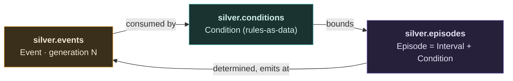
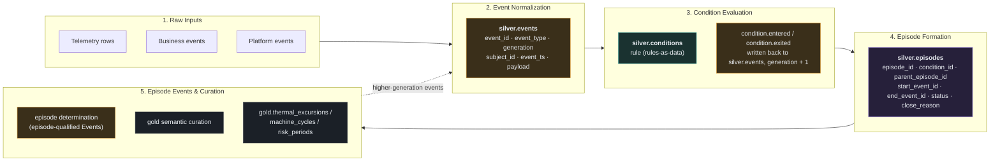

# Temporal Events and Episode Primitives for Kindling

**Status:** Draft — mechanism validated as a real, recurring need across current
clients. The first executable Kindling extension slice has landed, but it does
not yet implement the full proposal; see
`packages/extensions/kindling_ext_temporal/README.md` for the current implementation checklist.
**Created:** 2026-07-06
**Related:** `event_condition_episode_ontology.md` (the implementation-agnostic
model this proposal applies to Kindling), `data_entities.md`, `data_pipes.md`,
`entity_providers.md`, `signal_quick_reference.md`

**On Fabric Activator:** Activator (see "Fabric Activator as an Alternative
Backend" below) covers most of this proposal's condition vocabulary natively
and no-code. That's useful for validating the vocabulary is complete, but it
is *not* a reason to deprioritize this proposal — none of the current clients
this would serve are on Fabric, so Activator isn't an available substitute for
them. Treat the two as complementary, not competing: this proposal should stay
portable enough that a future Fabric client could use Activator as a pluggable
backend without changing anything downstream.

## Summary

This proposal introduces a Kindling extension concept for temporal reasoning over
event and time-series data. The extension lets teams declare generic Event,
Condition, and Episode primitives that materialize reusable tables, while
leaving business-specific meaning to normal `DataPipes` curation.

The core model is three ontological sets, not a five-rung ladder:

```text
Event      — a punctual occurrence, System-Observed or Synthetic
Condition  — a rule that classifies a stream of events (rules-as-data, not a
             Python-only declaration)
Episode    — an Interval satisfying a Condition, bounded by two Events
```

In short:

```text
Events are consumed by Conditions.
Conditions bound Episodes.
Episode determination emits Events.
```

That loop can repeat — an Episode-determination Event can be consumed by a
further Condition — but it never loops backward: every Event carries a
`generation` number that strictly increases each time a Condition derives a new
Event from an existing one. See "Generation and Recursion" for why that matters
and how it's enforced.



This diagram, and the general Event/Condition/Episode model it depicts, is
implementation-agnostic — see `event_condition_episode_ontology.md` for the
full treatment (including why Episode is not a kind of Event, the Interval
concept, and the prior art the model draws on). This document applies that
model to Kindling specifically.

### Pipeline at a Glance

The same loop, unrolled into the concrete stages a Kindling implementation
would actually run:



Events create Episodes. Conditions synthesize Events. Episode determination
emits higher-generation Events — the loop from stage 5 back into stage 2 in the
diagram above, bounded and made safe by generation numbers (see "Generation and
Recursion").

## Motivation

Many analytical domains need to reason about time intervals rather than only
point-in-time records:

- machine cycles and downtime periods;
- high-temperature or high-pressure episodes;
- customer sessions and risk windows;
- SLA breach periods;
- inactivity gaps;
- maintenance windows;
- delivery delay periods;
- alert lifecycles.

Today these patterns are usually implemented as bespoke PySpark transforms. The
logic often combines threshold checks, start/end event pairing, gap handling,
late data policy, and aggregation over an interval. That logic is valuable, but
it is hard to discover, reuse, test, or govern when it is embedded in one-off
pipe code.

Kindling is a natural place to incubate this because the concepts are declared
domain artifacts that should be registered, materialized, tagged, tested, and
curated like entities and pipes.

## Terminology

Fabric and real-time systems often use "event" broadly to mean any streaming
record or fact. This proposal aligns with that vocabulary while preserving more
precise classes in Kindling metadata. Two independent things distinguish an
Event from any other Event: **provenance** (did some system observe it, or did
a Condition derive it) and **generation** (how many derivation hops separate
it from a raw observation). Neither implies the other — a System-Observed
event is always generation 0, but a Synthetic event's *business* significance
is unrelated to how many hops produced it.

### Event

A punctual occurrence. Two provenance flavors:

- **System-Observed** — emitted natively by some system (a sensor, an API, a
  file landing process, another platform's event stream). Always
  `generation = 0`.
- **Synthetic** — computed by this extension's own engine from other Events.
  Always `generation >= 1`. Subdivides by how it was produced:
  - **Condition-spawned** — the entered/exited boundary of a Condition
    becoming or ceasing to be true (`condition.temperature_high.entered`).
  - **Aggregation-derived** — computed from a windowed aggregate.
  - **Correlation-derived** — computed from multiple Episodes' determination
    Events by a relation Condition (see "Relation Conditions" — designed but
    not in the MVP; cross-subject correlation remains an open question).
  - **Inference-derived** — computed by a model or scorer rather than an
    expression. Out of scope for the MVP; noted because it doesn't fit the
    `enter_when`/`exit_when` expression-string model at all and will need a
    different evaluation path if it's ever added.

Typical entity:

```text
silver.events
```

### Condition

A rule that classifies a stream of Events — the mechanism that produces
Condition-spawned boundary Events, and the mechanism that gives an Episode its
meaning. Conditions are **rules-as-data**, not Python-only declarations — see
"Conditions Are Rules, Stored As Data" for why and how. A Condition's declared
`consumes_event_type`, together with its produced types (derived from
`condition_id`, never separately declared — see "Condition-Derived Events"),
are what the generation graph is built from; see "Generation and Recursion."

Typical entity:

```text
silver.conditions
```

### Episode

A time interval bounded by two Events, satisfying a Condition. An Episode is
not a kind of Event — it's the fusion of an interval and the Condition that
gives it meaning, not a bare span of time. (A bare interval with no attached
Condition isn't an Episode at all; it's not a concept this extension needs.)
An Episode may be open, closed, expired, or invalidated depending on policy.

Examples:

- a condition-active period;
- a start/end event pair;
- an inactivity gap;
- a state span.

Typical entity:

```text
silver.episodes
```

### Episode-Determination Event

An Event produced when the system determines that an Episode exists or that its
lifecycle state changed. It is a punctual fact about the materialized Episode,
not the Episode itself. It lands in `silver.events`, carries
`correlation_id = episode_id`, and can be consumed by later Conditions like any
other Event. Examples:

- `episode.temperature_high_active.started`
- `episode.machine_cycle.completed`
- `episode.expired` / `episode.superseded` (lifecycle events about an
  Episode's own state transitions)

These are higher-generation Events at whatever generation the determined
Episode sits at, plus one. Semantic events such as `thermal_excursion.detected`
should be produced by ordinary Conditions consuming these determination Events,
or by later inference primitives, not by a separate Episode-specific engine.
See "Generation and Recursion" for why one shared events table with a
`generation` column is preferable to a table per level.

### Business Event (gold boundary)

A generation-N Event, or an Episode, that a normal `DataPipes.pipe()` reads
and curates into something business-named with no `event_type`/`generation`
columns left in it. That's the mechanical test for whether something has left
this extension's recursive system: participation in the generation graph
(silver, by this extension's definition) versus production by an ordinary
pipe with no such participation (gold). See "The Silver/Gold Boundary Is
Mechanical, Not Naming-Based."

## Design Principle: Generic Primitives, Business-Specific Curation

The extension should not force every Episode definition to be business-named.
The most reusable value comes from materializing generic Event/Condition/
Episode structures, and applying business meaning through ordinary
`DataPipes` curation on top of them.

Generic (extension-owned) tables:

```text
silver.events
silver.conditions
silver.episodes
```

Business-named (ordinary `DataPipes` output):

```text
gold.thermal_excursions
gold.machine_cycles
gold.sla_breach_periods
gold.customer_sessions
```

This lets multiple gold concepts reuse the same generic Episode. For example,
a `temperature > 90` Condition run may contribute to a thermal excursion
table, a maintenance-risk period table, and a machine-learning label table —
all read from the same `silver.episodes` rows, each curated independently by
its own pipe.

### The Silver/Gold Boundary Is Mechanical, Not Naming-Based

Whether something "sounds" business-specific (`thermal_excursion.detected`)
or generic (`derived_event`) doesn't determine which side of the boundary
it's on. The test is: does it carry `event_type`/`generation` and participate
in the Condition dependency graph (silver, regardless of how domain-flavored
its name is), or was it produced by an ordinary `DataPipes.pipe()` with
neither (gold, regardless of how generic its name is)? `thermal_excursion.
detected` is still silver — it's still in `silver.events` with a generation
number, still eligible to be consumed by a further Condition. Only once a
pipe reads it and produces something with no `event_type`/`generation` left
does it become gold.

The boundary is per-consumer, not per-artifact: the same `silver.episodes`
row can simultaneously feed a gold curation pipe (terminal) and a further
Condition (non-terminal, generation + 1). Different readers decide
independently whether they're exiting the recursive system or continuing it.

Rather than validating that a caller-supplied `output_entity_id` happens to
point at the right shape, the stronger fix is removing the choice entirely —
see "Resolving Canonical Entities." `DataEvents`/`DataEpisodes` registrations
don't take an output entity parameter at all; there's nothing for a caller to
point at the wrong table, so there's no per-declaration check needed for
Events or Episodes specifically.

The one place a real choice still exists, and still needs a check, is gold
curation: an ordinary `DataPipes.pipe()` genuinely does choose its own output
entity and schema, which is the entire point of gold curation, so that choice
can't be collapsed to a fixed constant the way the silver primitives' can.
The check there is a schema check on the *declared columns* of a gold
entity, not a runtime check of where a decorator points: a gold entity
declaration should be rejected (or at least flagged) if its own schema
includes `event_type`/`generation`/`episode_id`/`condition_id` columns —
those names are reserved for the silver primitives, and their presence on a
gold entity is the signal something crossed the boundary wrong, not a
consequence of a mistyped entity id.

## Proposed Extension

Start as a Kindling extension rather than core framework functionality.
Package name: `kindling-ext-temporal` — preferred over `kindling-events` because
Kindling's `signaling.py` already owns "event"/"signal" vocabulary for
framework observability; reusing "events" for this extension's domain events
invites exactly the kind of confusion this doc is trying to avoid. Prose
throughout should say "signal" for framework observability and "event" only
for this extension's domain Events.

The extension should feel first-class to Kindling users but remain optional
while the semantics mature.

### Registries

The extension adds registries similar in spirit to `DataEntities` and
`DataPipes`:

```python
DataEvents
DataEpisodes
```

`DataEvents` covers base-event normalization and Condition-engine
registration. `DataEpisodes` covers Episode formation from
Condition-produced boundary events. Condition *content* (thresholds, event
names) lives in `silver.conditions` as data — see the next section — the
registries are what the generic engine that interprets that data is
registered through.

### Event Envelope

The canonical event shape should be stable and small:

```text
event_id
event_type
generation
event_class
subject_type
subject_id
event_ts
source_system
correlation_id
payload
attributes
ingested_at
```

`generation` is always derived, never hand-specified — see "Generation and
Recursion." `subject_id` can be a stable composite value for multi-key
subjects, with `attributes` retaining the component keys; a later
implementation should promote `subject_keys` to first-class rather than
leaving multi-key subjects as a workaround, since composite-key subjects
(e.g., `(tenant_id, machine_id)`) are common enough that baking in a single
scalar now risks a breaking migration later.

### Events Are Snapshots, Not Mirrors

An event row is a snapshot of an observation at ingestion time, not a
mirror of the source row it was normalized from. If the source table
mutates afterward, the source moved — the fact didn't. Divergence between
`silver.events` and the *current* state of a bronze table is therefore by
design, not drift, and no synchronization mechanism should exist. Three
real concerns survive that framing:

- **Source corrections need an idempotency story — currently the biggest
  gap.** If a bronze row is upserted (a corrected sensor reading, a
  restated transaction), an incremental re-read would emit a *second*
  generation-0 event with the same subject and timestamp but different
  payload — two conflicting facts with no supersession link, and any
  Episode already formed from the old value doesn't know to re-form. The
  model-consistent answer is corrections-as-new-events (the same
  supersession discipline synthetic expiration already uses at the Episode
  level), which requires `event_id` to be derived deterministically from
  source-native keys so a re-emitted row arrives as a recognizable
  *revision* of a prior event, not an indistinguishable duplicate. Note
  this is a different case from late *arrival* (an event that was always
  correct showing up after the fact) — only late arrival is covered by the
  existing open question on revising closed episodes. See Open Questions.
- **The payload has no schema, so semantic drift is silent.** `payload`
  is semi-structured precisely so heterogeneous sources fit one envelope —
  which means a renamed source column fails loudly at normalization
  (fine), but a *meaning* change (a unit switch, a new enum value) flows
  straight through, and every Condition referencing `payload.temperature`
  misfires silently. The MVP validation pass checks that `enter_when`
  parses; it cannot check that the payload fields an expression references
  exist or still mean what the rule author assumed. The missing piece is a
  payload contract per `event_type` — a declared field list and types that
  `base_event()` commits to emitting and that the validation pass can
  check Condition expressions against. See Open Questions.
- **Under-selected `payload_columns` is the ordinary materialization
  tradeoff.** A future Condition may need a field nobody carried into the
  payload; historical events can't answer it. Bronze is retained, so the
  mitigation is ordinary re-normalization and backfill — but a backfill
  re-emits generation-0 events, which is only safe under the same
  `event_id` idempotency the corrections case requires. The two concerns
  share one fix.

The inverse case is worth naming: any future mechanism that joins
slowly-changing context (a machine's rated capacity, a customer's tier) at
evaluation time *instead of* copying it into the payload avoids stale
copies entirely — but inherits the temporal version of the same problem,
because a replay would see the dimension's *current* value, not its value
at event time. That's the same bitemporal issue `valid_from`/`valid_to`
solves for Condition content, and it would need the same as-of discipline.

## Conditions Are Rules, Stored As Data

An earlier draft of this proposal expressed Conditions as either pure Python
decorators or an equivalent YAML config block. Neither is right for Kindling:
YAML-as-declaration lets config *originate* a Condition from nothing, which
breaks the framework's Python-first tenet (config augments a Python-declared
shape; it doesn't create one). But pure Python decorators don't scale to
per-machine, per-customer cardinality, and can't express a rule whose
threshold is itself computed by another pipeline (e.g., a rolling statistical
baseline) rather than a static literal.

The resolution: Condition **content** (thresholds, event names, `enter_when`/
`exit_when`) is data, stored in an SCD2-tagged entity; the Condition
**engine** (the code that parses expressions, pairs boundary events, and
manages Episode lifecycle) stays 100% Python, decorator-registered, and
domain-agnostic — the same separation Kindling already applies to base event
payloads (domain-specific content flowing through a domain-agnostic schema).

### Storage

```python
@DataEntities.entity(
    entityid="silver.conditions",
    merge_columns=["condition_id"],
    tags={
        "scd.type": "2",
        "scd.routing_key": "hash",
        "scd.close_on_missing": "true",
        "scd.current_entity_id": "silver.conditions.current",
    },
)
```

Columns:

```text
condition_id
consumes_event_type  -- one or more event types; a relation Condition lists
                        both determination event types it pairs (see
                        "Relation Conditions")
subject_type
parameters        -- map<string,string>: enter_when, exit_when, min_duration,
                      max_duration, expires_after, emits_when, etc.
enabled
valid_from        -- business-authored; defaults to ingestion time
valid_to          -- business-authored; null while current
```

No `input_entity_id`/`output_entity_id` columns — every Condition reads from
and writes to the same canonical events entity, resolved by
`TemporalEntityResolver` (see "Resolving Canonical Entities"), not chosen per
row. `valid_from`/`valid_to` are business-authored and distinct from the SCD2
system columns SCD2 manages on this same entity (`effective_from`/
`effective_to`) — see below for why replay needs both to exist separately.

### Resolving Canonical Entities

`DataEvents`/`DataEpisodes` never take a caller-supplied output entity,
because there's only ever one correct destination for each — the canonical
events entity for anything producing Events, the canonical episodes entity
for anything producing Episodes. Rather than a config key a caller could
still get wrong or leave stale, this follows the same pattern Kindling
already uses for watermark storage: an abstract, DI-swappable resolver with
a hardcoded default, not a `settings.yaml` string.

`WatermarkEntityFinder`/`SimpleWatermarkEntityFinder` (`watermarking.py`) is
the existing precedent — `SimpleWatermarkEntityFinder` hardcodes
`entityid="system.watermarks"` in its constructor, with no `ConfigService`
read anywhere in the default path; a team needing different watermark
storage binds an alternative `WatermarkEntityFinder` implementation via the
injector, not a config value. This is a new class *following the same
pattern*, not a change to watermarking itself:

```python
class TemporalEntityResolver(ABC):
    @abstractmethod
    def get_events_entity(self) -> Any: ...
    @abstractmethod
    def get_episodes_entity(self) -> Any: ...
    @abstractmethod
    def get_conditions_entity(self) -> Any: ...


@GlobalInjector.singleton_autobind()
class SimpleTemporalEntityResolver(TemporalEntityResolver):
    """Default implementation — one shared events/episodes/conditions set
    for the whole app."""

    def __init__(self):
        self._events_entity = SimpleNamespace(entityid="silver.events", ...)
        self._episodes_entity = SimpleNamespace(entityid="silver.episodes", ...)
        self._conditions_entity = SimpleNamespace(entityid="silver.conditions", ...)

    def get_events_entity(self) -> Any:
        return self._events_entity

    # get_episodes_entity / get_conditions_entity follow the same shape
```

`DataEvents.condition_engine()` and `DataEpisodes.episode()` resolve their
entities by calling
`GlobalInjector.get(TemporalEntityResolver)` internally. A team needing
team-scoped or environment-scoped tables binds an alternative resolver once,
at their own bootstrap — the same override point already proven for
watermark storage — instead of every Condition/Episode declaration
re-specifying a string that could drift out of sync with what the
generation graph assumes (see "Generation and Recursion" for why that
drift would silently break cycle-detection's closure guarantee).

`base_event()` is the one declaration that still takes a real
`input_entity_id` — different normalizers legitimately read from different
bronze sources, which is the whole point of normalization — but its output
side resolves through `TemporalEntityResolver` the same as everything else.

`scd.close_on_missing` means a Condition dropped from the next ingested batch
closes automatically — no separate soft-delete flag needed.

**`read_entity_as_of` is the wrong tool for replay correctness, and an
earlier draft of this proposal used it anyway.** `effective_from_column`/
`effective_to_column` are stamped with `current_timestamp()` at merge time —
system/ingestion time, not business-valid time. `read_entity_as_of(entity,
event.event_ts)` answers "what was the current row as of wall-clock time T,"
not "what rule did the business intend to be in effect for an event that
happened at T" — those diverge exactly when a rule change is backdated
(corrected today, intended to apply retroactively from last week) or when
the ingestion pipeline updating `silver.conditions` runs behind the change it
represents. Using the SCD2 system-time columns for replay would silently use
the wrong rule version in both cases.

The fix is a second, business-authored pair of columns on the Condition row
itself — `valid_from`/`valid_to` — distinct from the SCD2-managed
`effective_from`/`effective_to`, defaulting to ingestion time if the rule
author doesn't override them, but explicitly settable for a backdated
correction. Replay then needs a direct filter over *all* historical versions
of a `condition_id` on those business columns
(`WHERE condition_id = X AND valid_from <= event_ts AND (valid_to IS NULL OR
valid_to > event_ts)`), not `read_entity_as_of`. Exactly how "all historical
versions" gets queried — whether SCD2's own row history is sufficient to
carry a second, independent valid-time range per version, or whether this
needs its own bitemporal handling — is unresolved; see Open Questions.

### Management

Adding, modifying, or removing a Condition is an ordinary SCD2 upsert through
whichever ingestion path feeds the table — a file drop through
`SimpleFileIngestionProcessor`, a small CLI (`kindling conditions set/remove`),
or a direct write from any tool with access to the Delta table. None of this
needs new Kindling machinery; it reuses the SCD2 merge logic and the existing
file-ingestion path.

**What this is worth, concretely:** change latency decoupled from deploy
cycles; cardinality Python decorators can't practically express (hundreds of
per-machine thresholds as rows, not decorator calls); rule content that can
be computed by another pipeline rather than statically declared; governance
separation (rule-content write access via table ACLs, without touching repo
permissions).

**What it costs, and must be built, not assumed:** no compile-time review of
rule semantics — a bad `enter_when` passes silently into the table where a
bad Python expression wouldn't survive code review. **A validation pass is a
required MVP item, not optional polish** — see MVP below.

**When not to do this:** if every Condition will always be authored by an
engineer comfortable with a PR, and rule count stays in the dozens, plain
Python decorators are simpler and this whole apparatus is unjustified
overhead. This design pays for itself specifically when rule ownership,
cardinality, or computed thresholds are real, not by default.

### Interpretation at Runtime

`enter_when`/`exit_when`/`emits_when` are plain Spark SQL expression strings,
materialized with `pyspark.sql.functions.expr()` — bounded by Spark's
Catalyst grammar, not `eval()`, so this is safe against arbitrary code
execution even though the strings are business-authored data. Duration-like
parameters (`min_duration`, `expires_after`) are stored as plain numeric
seconds rather than free-text strings — there's no existing duration-string
parser in the codebase to reuse, and Spark's own string-accepting duration
APIs (`withWatermark`, `Trigger.ProcessingTime`) only take them at
query-construction time, not as arbitrary comparison values, so storing the
number sidesteps the parsing problem entirely.

Execution is a driver-side loop over the small set of active Conditions
(tens to low hundreds, safe to `.collect()`, unlike event data), each
iteration issuing its own lazily-planned Spark filter/transform — not one
mega-expression trying to encode every rule at once. **This is the one
evaluation engine for both execution modes** — batch runs drive it from a
scheduler over bounded slices, and streaming runs drive the same loop from
inside a `foreachBatch` trigger body (see "Streaming"); only the opt-in
subsecond tier uses a different mechanism:

```python
active_conditions = spark.read.table("silver_conditions_current").collect()
results = []
for condition in active_conditions:
    scoped = base_events.filter(F.col("subject_type") == condition.subject_type)
    entered = scoped.filter(F.expr(condition.parameters["enter_when"]))
    exited = scoped.filter(F.expr(condition.parameters["exit_when"]))
    results.append(build_episode_boundaries(entered, exited, condition))
output = reduce(DataFrame.unionByName, results)
```

### Cross-Reference: Fabric Activator's Condition Vocabulary

Comparing against Fabric Activator's own condition categories (state, change,
heartbeat, occurrence) validated that this expression-string model covers
nearly everything Activator supports as a plain Spark SQL predicate,
including stateful "change" conditions via `LAG()` over a subject-ordered
window — which requires all relevant rows to be present at once, i.e. a
bounded slice. That requirement is met in *both* execution modes, because
streaming execution runs the same engine over per-trigger bounded slices
via `foreachBatch` (see "Streaming"); only the opt-in subsecond tier,
where rows are processed as they arrive, needs the stateful-streaming
equivalent (`applyInPandasWithState` / `flatMapGroupsWithState` —
per-subject state read and updated explicitly rather than computed by a
window function).

The one real gap in the SQL-expression model itself, independent of
execution mode: Activator's "no presence of data" (heartbeat) condition
has to fire even when nothing arrives, which can't be a row-level
predicate at all — it needs a wall-clock timer. That's not a new problem
here; it's exactly what synthetic expiration events already exist to solve
(see below): the engine's per-run/per-trigger expiration sweep provides
the timer in both modes (with the empty-trigger caveat noted in
"Streaming"), and `GroupState.setTimeoutDuration`/`setTimeoutTimestamp`
provides it natively in the subsecond tier. Activator's "true for a
duration" occurrence similarly has a retroactive form (SQL-expressible via
the same window-function technique over bounded slices) and an
instant-on-crossing form that belongs to the same timer mechanisms.

## Episode Shape

The generic episode table supports both closed and open intervals:

```text
episode_id
episode_type
condition_id
parent_episode_id
subject_type
subject_id
start_event_id
end_event_id
start_time
end_time
status
close_reason
end_event_synthetic
duration_ms
event_count
created_at
updated_at
attributes
```

Potential `status` values: `open`, `closed`, `expired`, `superseded`,
`invalidated`.

Potential `close_reason` values: `end_event`, `condition_exited`,
`max_duration`, `max_gap`, `expiration_event`, `manual_replay`.

`parent_episode_id` is nullable, self-referencing, and structural only — see
"Relationships Between Episodes" below for what it does and, just as
importantly, what it must never be used for.

### `start_event_id` and `end_event_id` Are Two Separate Rows

An Episode's boundaries are two distinct rows in `silver.events`, referenced
by two separate foreign keys — never inlined or merged into one record. Three
things only work because they're independent:

1. **They're independently meaningful.** The entered and exited events are
   each capable of being consumed on their own by something that only cares
   about one boundary.
2. **An open Episode doesn't have an end yet.** `end_event_id` is simply
   `NULL` while the Condition is still active — there's no event to point at,
   and a pure join-based view has nothing to return for an interval that
   isn't complete yet, with no stable identity across separate query
   executions for "this specific still-open occurrence."
3. **Revision-in-place swaps one reference, not the whole record.** When a
   real end event supersedes a synthetic expiration event, `end_event_id`
   moves; `episode_id` and `start_event_id` stay untouched.

`start_time`/`end_time` are denormalized onto the Episode row (copied from
the two events' `event_ts` at write time) purely so episodes can be
filtered/sorted by time range without a join back to `silver.events` on
every query — the event rows remain the source of truth.

### Why Episodes Are Materialized, Not Computed On Demand

An Episode is a relation, but not a cheap one: matching each exited event to
its corresponding entered event for the same subject is the classic
gaps-and-islands problem — window-function-expressible, but expensive to
recompute from scratch on every read. A live view also can't represent an
open Episode (nothing to join on both sides yet, no persisted identity across
separate query executions) or support revision-in-place (nothing to update;
a view recomputes from nothing every time). Everything downstream — episode
membership, higher-generation event correlation, gold curation — needs a
stable `episode_id` to reference, which only a materialized row provides.

### Where Episode Boundaries Come From

`condition()` deriving boundary events from raw signal (per "Interpretation
at Runtime") is not the only legitimate source of an Episode's boundaries,
and it's often not the best one.

**When a source system already assigns a discrete grouping key, ingest that
key directly instead of deriving boundaries from timestamps.** A batch ID,
run ID, record number, or step number already present in `bronze.*` data
gives exact, unambiguous interval membership — a row either carries
`batch_id = X` or it doesn't. Reconstructing the same membership from a
timestamp range instead has to get several genuinely hard things right:
whether a reading exactly at the boundary is in or out, clock skew between
whatever system stamped the reading and whatever system defines the
interval, out-of-order or late-arriving rows, and same-timestamp collisions
at whatever resolution the source clock provides. A `base_event()` normalizer
that carries the source's own grouping key through into the event envelope's
`attributes`, paired with a `condition()` whose `enter_when`/`exit_when` is
close to trivial ("same `batch_id`"), sidesteps all of that — not because
it's more convenient, but because equality on a discrete key has no
boundary-sensitivity to get wrong in the first place, unlike a timestamp
range comparison. Treat this as the default whenever a source-native key is
available, not a fallback for when Condition logic would be inconvenient.

**Other segmentation mechanisms map onto provenance categories already in
this proposal, not new ones:**

- A condition that toggles on and off — the gaps-and-islands pattern this
  proposal's `condition()`/`enter_when`/`exit_when` model already targets.
- A continuous signal with no discrete triggers, segmented by a changepoint
  or regime detector, is Inference-derived (see `event_condition_episode_
  ontology.md`) — the boundary comes from a model's output, not an
  expression, and doesn't fit the `F.expr()` evaluation path at all. Out of
  MVP scope; noted in Open Questions.
- A procedural decomposition (a manufacturing batch's stages and steps) is
  Hierarchy between Episodes — see below — not a new kind of boundary
  detection.

### Relationships Between Episodes

Episodes relate to each other in two structurally different ways, and this
proposal's schema must not let them collapse into one.

**Hierarchy** is `parent_episode_id` — a structural claim, this Episode is
part of that Episode by process decomposition (a batch containing stages).
Sibling episodes under the same parent should not overlap each other, and
duration/count rollups at a given level are aggregates over that level's
children. Hierarchy is independent of generation: a parent Episode and its
child can come from Conditions at the same generation or different ones —
nesting and derivation depth are separate axes.

**Temporal relations** are a computed fact about two Episodes' underlying
Intervals — evaluated purely from `start_time`/`end_time` — with no
structural relationship implied at all. A fault-condition Episode and a
pressure-condition Episode might overlap without either containing, causing,
or being part of the other. **`parent_episode_id` must never be set based on
one Episode's Interval merely falling inside another's** — that smuggles in
a structural claim that isn't true, and it costs the ability to query
hierarchy and temporal overlap independently later, exactly when a question
spans both ("how much of stage 2 was spent inside a fault condition" is a
join between a hierarchy query and a temporal-relation query, not answerable
at all if the fault episode was wrongly filed as stage 2's child).

Describe temporal relations using Allen's interval algebra (see
`event_condition_episode_ontology.md`) rather than ad hoc terms — the coarse
overlap test is a single predicate (`A.start <= B.end AND B.start <= A.end`
under whatever interval convention is in force), and classifying which of
the thirteen relations applies from there is a small set of boundary
comparisons. Where that classification happens depends on what consumes it:
a gold-layer analytical pipe computes it terminally for reporting, and a
relation Condition (see "Relation Conditions" below) computes it inside the
model when the relation itself needs to become an Event that further
Conditions can consume. This proposal
recommends the same half-open interval convention (`start_time` inclusive,
`end_time` exclusive) the ontology document recommends generally, applied
consistently to `silver.episodes` so exact-boundary relations (`meets` vs.
`overlaps`) are unambiguous.

### Relation Conditions: Correlating Two Episodes Without a Join Mechanism

Stream-to-stream correlation ("did a fault Episode overlap a pressure
Episode on this machine?") needs no join machinery at the Condition layer.
It decomposes into pieces this proposal already has:

1. Two ordinary single-stream Conditions, evaluated independently, each
   forming its own Episode.
2. Each Episode's determination Event lands back in `silver.events`,
   carrying the interval boundaries in its payload snapshot (see "Where
   Higher-Generation Events Actually Come From" — this is why the snapshot
   must include `start_time`/`end_time`, not just duration and status).
3. A **relation Condition** — an ordinary Condition row — consumes *both*
   determination event types, pairs them per subject, and classifies the
   Allen relation from the two payloads' boundaries. Its output is a
   Correlation-derived Event at `generation = 1 + max(generation of both
   consumed types)`, eligible to feed further Conditions like any other.

Nothing evaluates a Condition against `silver.episodes` — the recursive
loop flows through `silver.events` only. The episodes table remains the
durable record for identity, revision-in-place, and gold curation; the
determination Event is what participates in recursion, and its payload
snapshot is the transport that keeps Condition evaluation single-source.

Both determination event types must be declared in `consumes_event_type` —
never fetched as a side lookup during evaluation. Declaring both is what
makes the existing event-type graph do all the work: generation arithmetic
(`1 + max`), cycle rejection, and topological execution ordering all fall
out with no new machinery. An undeclared companion dependency would be
invisible to `detect_cycles()`, and the topological walk could evaluate the
relation Condition before the Condition that produces its companion within
the same run — exactly the silent closure-guarantee break the generation
graph exists to prevent.

Pairing two event types per subject across runs is the same shape as
event-pair Episode formation (`machine.started`/`machine.stopped` plus
persisted open-episode state) — a classification step at the end instead of
interval construction. The companion determination Event that arrived in an
earlier slice — already behind the relation Condition's own watermark — is
the same "previous value written in an earlier run" problem already named
for `LAG()` at slice boundaries, solved by the same lookback-window
mechanism in both execution modes (streaming runs the same engine over
per-trigger bounded slices — see "Streaming").

A schematic Condition row (the exact expression surface for referencing the
two paired events from `enter_when` is an engine implementation detail to
settle):

```text
condition_id: condition.fault_during_pressure
consumes_event_type: [episode.fault_active.closed, episode.pressure_high.closed]
parameters:
  enter_when: fault.payload.start_time < pressure.payload.end_time
              AND pressure.payload.start_time < fault.payload.end_time
  candidate_window: 86400
```

Two constraints scope the primitive:

- **A candidate window is required, not optional.** Overlap-family relations
  are self-limiting (the coarse overlap predicate bounds candidates), but
  every historical fault Episode is `before` the current pressure Episode —
  disjoint relations are combinatorially meaningless without a bounded
  window parameter on the relation Condition row.
- **Same-subject pairing only.** Both consumed determination Events must
  share `subject_id`. Correlating across different subject types (a
  machine-level fault against a line-level pressure Episode) needs a
  subject-mapping story that doesn't exist yet — see Open Questions.

Episode revision composes with this for free: a revised Episode (a real end
event superseding a synthetic expiration) emits a superseding lifecycle
Event back into `silver.events`, which re-triggers the relation Condition
through the same path — a corrected relation Event needs no separate
correction channel. Whether the corrected Event supersedes or appends to
the one computed from the stale boundary folds into the existing open
question on revision behavior.

Relation Conditions are not in the MVP. They're specified here because they
resolve what "Correlation-derived" means concretely, and because the two
things they depend on — interval boundaries in the determination-event
payload snapshot, and `consumes_event_type` holding more than one type —
are schema decisions that are cheap to make now and breaking changes later.

### Synthetic Expiration Events

Any Episode start event can be closed by an explicit end event or by a
synthetic expiration event. Expiration should be modeled as a generated
event, not as hidden episode metadata, so the boundary remains explainable
and composable.

For example, if `machine.started` arrives but no `machine.stopped` arrives
within the configured expiration period, the extension can emit:

```text
episode.machine_cycle.expired
```

That synthetic event becomes the episode's `end_event_id`, with
`end_event_synthetic = true` and `close_reason = expiration_event`.

If the real `machine.stopped` event later arrives within the allowed revision
period, it can supersede the synthetic end event. The extension should then
revise the episode to use the real end event, mark or emit a lifecycle event
for the superseded synthetic closure, and make the correction visible through
normal higher-generation event outputs.

This makes expiration a first-class temporal rule:

- open episodes can be closed without waiting forever;
- downstream consumers can distinguish real and synthetic closure;
- late real end events can correct synthetic closure;
- expiration events can themselves trigger downstream evaluations, at the
  next generation.

### Episode Membership

Membership is optional because it can be large. When enabled, it maps events
that occurred *during* an episode (not just its boundary) to that episode:

```text
episode_id
event_id
event_ts
offset_ms
ordinal_in_episode
membership_reason
```

Membership is a different relationship than boundary construction — an event
can be a member of an episode without having caused it to open or close, and
conflating "caused this episode" with "happened during this episode" loses
exactly the distinction this whole model exists to preserve.

## Generation and Recursion

Evaluating an Episode's properties can emit a new, higher-order Event
(`thermal_excursion.detected`), and nothing prevents that Event from becoming
the input to a *further* Condition — three excursions in a week could itself
be a Condition watching for a pattern of `thermal_excursion.detected` events.
That's genuinely useful (it's the same "complex events built from simpler
ones" pattern in standard CEP literature), but it has to terminate, and it
has to be bounded work per run.

### Why Not Naive Iteration

"Keep re-running the pipeline until no new events appear" is a real pattern
(Datalog's fixpoint semantics, RETE-style forward chaining), but it has two
real problems here: it doesn't terminate without cycle prevention, and it
makes a run's cost data-dependent — the number of iterations needed varies by
how many cascade levels happen to fire, which quietly breaks the "deterministic
for a given input slice" requirement this proposal already commits to for
incremental execution.

### The Fix: Generation Numbers, Computed, Never Hand-Specified

Every Event carries a `generation` number:

```text
generation(base event_type) = 0
generation(produced event_type) = 1 + max(generation of every event_type
                                            consumed by the Condition(s) that
                                            produce it)
```

This is derived entirely from what each Condition row already has —
`consumes_event_type` is the only field it declares; its produced types are
computed, not declared, using the same `{condition_id}.entered`/
`{condition_id}.exited` convention the runtime engine itself uses (see
"Condition-Derived Events") rather than a second stored column that could
drift out of sync with what the engine actually emits. A Condition author
writes what it reads; both the produced-type strings and the generation
number are byproducts, never hand-specified.

The computation reuses `PipeGraphBuilder`'s existing algorithms
(`detect_cycles()`, `get_generations()`, already built and used for ordinary
`DataPipes` ordering) applied to a small graph whose nodes are `event_type`
strings and whose edges connect each Condition's declared `consumes_event_type`
to its two computed produced types — not the physical entity graph, since
every Condition/Episode/Event lives in the same three tables and an
entity-level graph would falsely read as a self-loop. This graph is
recomputed and cycle-checked whenever the Conditions
table changes — the same moment the rules-as-data validation pass already
runs — and the result (a small `event_type -> generation` lookup) is cached,
not recomputed per event. Generation is stamped once, at write time, and
never rewritten retroactively if the rule graph changes later; historical
rows keep the generation that was correct when they were written.

If a Condition consumes multiple event_types (a relation Condition pairing
two determination event types — see "Relation Conditions"), take the max
across all of them, not just one, so the produced type's generation is
always strictly ahead of everything it depends on.

### Only Events Carry Generation

Conditions and Episodes don't need their own generation tracking. A Condition
is a rule definition, not an occurrence — it isn't a point in the recursive
chain, it's what produces the chain. An Episode inherits its generation from
whichever Condition produced it — a derived property, computed once, never
independently stored. Keeping generation scoped to Events specifically is
what keeps the event-type graph small and the recursion axis contained to one
place instead of leaking into every table.

### Execution Consequence: Layer By Generation, Within One Run By Default

An earlier draft of this section required each *scheduled run* to advance
only one generation boundary, costing "N levels deep = N times base
latency." That conflated two different things: avoiding unbounded,
data-dependent iteration (the real risk, addressed above) with throttling to
one generation per run (an unnecessarily strong, costly conclusion that
doesn't follow from it). The generation graph is computed and validated
acyclic *before* any run starts, so the number of generations is known and
fixed going in — walking all N of them in topological order **within a
single orchestrated run** carries none of the naive-iteration risk, because
there's no data-dependent stopping condition to get wrong. Generation N's
Condition evaluations write fully to `silver.events` (an atomic Delta commit)
before generation N+1's evaluations start reading; ordering the stages
sequentially, driven by the same `get_generations()` list already computed
for cycle-checking, is sufficient — no cross-run latency is required by
correctness.

Single-run topological execution should be the default. Staging generations
across separate scheduled runs is still a legitimate *operational* choice —
smaller individual run sizes, or a restart-safety checkpoint between
generations — but it's an optimization/ops tradeoff to opt into, not
something correctness requires.

Each Condition still tracks its own read position using Kindling's
per-reader watermark cursors —
`get_cursor(source_entity_id="silver.events", reader_id=condition_id)`,
with the cursor being a Delta version since `silver.events` is
Delta-backed — filtered to the generation(s) it consumes, so a
generation-2 Condition only ever picks up generation-1 events it hasn't
seen yet, whether that generation-1 data was written earlier in the same
run or in a previous one. The condition engine is a deliberate *explicit*
consumer of the watermark API (many readers over one entity), distinct
from the pipe-scoped `WatermarkAspect` that handles ordinary pipes'
driving-source reads; both record the cursor covering exactly what was
read (bounded with CDF `endingVersion`), which is what makes each slice
deterministic and each advance safe against writes landing mid-run.

### Where Higher-Generation Events Actually Come From

`condition()` reads from `silver.events` (raw or prior-generation) to produce
boundary events — it has to; the Episode doesn't exist yet at that point.
`DataEpisodes.episode()` then materializes the Episode and emits an
Episode-determination Event such as `episode.machine_cycle.completed` or
`episode.temperature_high_active.closed` back into `silver.events`. That Event
carries `correlation_id = episode_id` and a payload/attributes snapshot of the
Episode's relevant properties — `start_time`, `end_time`, `duration_ms`,
`status`, `close_reason`. The interval boundaries in that snapshot are
load-bearing, not a convenience: relation Conditions (see "Relation
Conditions") classify Allen relations from the boundaries carried in two
determination Events' payloads, which is what lets Condition evaluation stay
single-source over `silver.events` instead of joining back to
`silver.episodes`.

From there, the ontology takes over uniformly: semantic classification is just
another Condition consuming an Event. A Condition can watch for
`episode.machine_cycle.completed` and emit `machine_cycle.long_detected`; no
separate Episode-specific evaluation primitive is required.

## Declaration Examples

### Base Event Normalization

```python
@DataEvents.base_event(
    eventid="telemetry.base",
    input_entity_id="bronze.raw_telemetry",
    subject_type="machine",
    subject_keys=["machine_id"],
    time_column="event_ts",
    event_type="telemetry.observed",
    payload_columns=["temperature", "pressure", "status"],
)
def normalize_telemetry(df):
    return df
```

`input_entity_id` varies legitimately per normalizer (different bronze
sources); there's no `output_entity_id` — it always resolves to the
canonical events entity via `TemporalEntityResolver`.

### Condition-Derived Events

An earlier draft showed a `@DataEvents.condition(conditionid="condition.
temperature_high", ...)` decorator keyed to one specific `condition_id`. That
example contradicted the rest of this proposal: if every row in
`silver.conditions` still needs a matching decorator call, cardinality never
actually moved into data — hundreds of per-machine thresholds would still
mean hundreds of decorator calls, exactly the problem rules-as-data exists to
avoid. The engine is registered *once*, independent of how many Condition
rows exist; adding a Condition is purely a data operation (an insert into
`silver.conditions`), never a new Python declaration:

```python
@DataEvents.condition_engine(
    engineid="condition_engine.default",
)
```

No entity parameters at all — the engine resolves both the Conditions
entity and the events entity via `TemporalEntityResolver` (see "Resolving
Canonical Entities"), since there's exactly one correct value for each and
no legitimate reason for it to vary between engine registrations. This
single registration is what runs the driver-side loop described in
"Interpretation at Runtime" — collecting every current row from
`silver.conditions.current` and evaluating each one's `enter_when`/
`exit_when` against the resolved events entity. `consumes_event_type` lives
on each *row*, not on the engine registration — it's the one field genuinely
new
relative to ordinary entity/pipe declarations, a plain string naming a value
of the `event_type` column that already exists in the canonical envelope.
The produced side needs no declaration at all: a Condition row always emits
exactly `{condition_id}.entered` / `{condition_id}.exited`, the same way
`_PipeIds` already derives a secondary identifier from a primary declared id
rather than requiring a second name.

For a given `condition_id` (e.g. `condition.temperature_high`) this emits:

```text
condition.temperature_high.entered
condition.temperature_high.exited
```

### Episode From Boundary Events

```python
@DataEpisodes.episode(
    episodeid="episode.temperature_high_active",
    start_event="condition.temperature_high.entered",
    end_event="condition.temperature_high.exited",
    min_duration="2 minutes",
    max_duration="4 hours",
    late_event_grace="5 minutes",
)
```

No `output_entity_id` — every Episode resolves to the canonical episodes
entity via `TemporalEntityResolver`, same reasoning as Conditions and Events.

### Event-Pair Episode

```python
@DataEpisodes.episode(
    episodeid="episode.machine_cycle",
    start_event="machine.started",
    end_event="machine.stopped",
    subject_type="machine",
    expires_after="8 hours",
    expiration_event="episode.machine_cycle.expired",
)
```

### Semantic Condition Over Episode-Determination Events

An Episode being determined is itself an Event. Semantic interpretation uses
the same Condition machinery as everything else:

```text
condition_id: condition.thermal_excursion
consumes_event_type: episode.temperature_high_active.closed
parameters:
  enter_when: payload.duration_ms > 900000
  emits_event_type: thermal_excursion.detected
  severity: warning
```

The important point is that semantic value inference is another Condition row
consuming the Episode-determination Event, not a special side channel. The
emitted Event can later become the input to a further
Condition, or be curated directly into gold.

### Gold Curation

Gold curation stays normal Kindling pipe work, with no `event_type`/
`generation` concept at all — this is the mechanical marker that it's on the
gold side of the boundary:

```python
@DataPipes.pipe(
    pipeid="gold.thermal_excursions",
    input_entity_ids=["silver.episodes", "silver.events"],
    output_entity_id="gold.thermal_excursions",
    output_type="table",
    tags={"domain": "operations"},
)
def curate_thermal_excursions(episodes, events):
    return (
        episodes
        .join(events, "episode_id")
        .filter("event_type = 'thermal_excursion.detected'")
    )
```

## Execution Model

The user declares temporal concepts; the extension chooses the execution
strategy behind normal Kindling pipes. Routine execution is incremental:
process new or changed events, update open and recently closed episodes, and
avoid full-table passes except during explicit replay or backfill.

### Incremental Bounded Execution

Incremental bounded execution is the default table-oriented path. A Kindling
pipe reads a bounded slice of new or changed events at the generation it
consumes, combines it with persisted episode state, and writes only the
affected higher-generation events and episode rows.

This path uses Kindling's existing per-reader watermarking, scoped by
generation (see "Generation and Recursion"), to identify:

- new events at the consumed generation since the last successful run;
- open episodes for affected subjects;
- recently closed episodes still inside the late-arrival grace period;
- synthetic expiration events that need to be created for stale open
  episodes;
- a small lookback range needed for transition detection at slice
  boundaries.

Bounded primitives compile to ordinary Spark DataFrame operations:

- ordering within subject;
- `lag` / `lead`;
- transition detection;
- cumulative grouping (gaps-and-islands);
- interval pairing;
- grouped episode aggregation.

This requires explicit policy for:

- how long closed episodes can be revised;
- how late events are handled;
- when open episodes expire;
- how real end events supersede synthetic expiration events;
- whether changes produce replacement rows or correction events.

The bounded implementation is deterministic for a given input slice plus
persisted episode state, and does not scan the entire input entity on every
run.

### Streaming

Streaming execution maintains open episode state and emits lifecycle events
as data arrives. Streaming support is part of the product shape, not an
optional someday add-on.

**Streaming is the same engine, driven by triggers — not a second
implementation.** An earlier draft of this section treated batch and
streaming as two implementations of the same semantics (`LAG()` plus a
lookback window in bounded execution; `applyInPandasWithState` per-subject
state in streaming). That framing doubles the engine surface to build,
test, and keep semantically identical. The resolution: streaming execution
is a `foreachBatch` wrapper around the incremental bounded engine.
Structured Streaming hands `foreachBatch` a bounded DataFrame per
trigger — and a bounded slice plus persisted episode state is exactly the
input the bounded engine already consumes. One engine, two drivers: a
scheduler in batch mode, a streaming trigger in streaming mode.

What the unified engine resolves by construction:

- **The generation walk stops being a streaming problem.** The
  single-events-table design would create a self-loop in pure streaming (a
  query reading `silver.events` while writing condition outputs back to
  it). Under `foreachBatch`, the *stream* reads only base sources
  (bronze → normalization); condition evaluation, episode formation, and
  all higher generations run as the same topological walk inside the
  trigger body, with ordinary batch writes back to `silver.events`. The
  generation graph stays what it already is — a validation-time concept
  (cycle rejection, ordering) — with no per-generation streaming queries
  to orchestrate.
- **Determinism-per-slice survives.** "Deterministic for a given input
  slice plus persisted episode state" is a batch property pure stateful
  streaming cannot easily honor; per-trigger bounded slices keep it
  intact, and keep the test story unified — the streaming path is tested
  by invoking the same engine with the same slices.
- **Episode revision-in-place works by construction.** Superseding a
  synthetic expiration with a real end event is a Delta merge —
  impossible in a pure streaming sink, ordinary inside `foreachBatch`.
- **Replay is unchanged.** Stop the stream, run the existing bounded
  replay (business-time Condition filtering), reset the affected
  per-condition cursors, restart. The streaming checkpoint is untouched
  because it tracks source ingestion, not derived state.
- **The lookback mechanism is shared, not duplicated.** The bounded
  path's "small lookback range at slice boundaries" (a plain `LAG()` over
  only the current slice returns nothing meaningful for each subject's
  first row — the true previous value was written in an earlier run)
  applies identically per trigger. No separate per-subject state store.

**Incrementality ownership — one owner per hop.** The streaming checkpoint
owns progress on the source→events hop; per-reader cursors (see
"Generation and Recursion") own each Condition's progress over
`silver.events`, identically in both modes. No double bookkeeping. This is
the same principle Kindling's watermark refactor established: whoever owns
a hop's incrementality is its only tracker — batch pipes attach the
`WatermarkAspect`, engines that own their own incrementality (streaming
checkpoints here; a declarative-pipelines backend in
`declarative_pipelines_engine.md`) simply don't.

**Two residuals genuinely differ from batch, and are tiered rather than
papered over:**

- **Heartbeat/expiration with zero arrivals.** Spark can skip empty
  micro-batches, so "fire when nothing arrives" needs either a forced
  per-trigger tick or the batch engine's existing answer (the expiration
  sweep each run performs) on a scheduler tick. Cheap, but it is the one
  place trigger-driven execution is not automatically sufficient.
- **Latency floor.** `foreachBatch` gives seconds, not subseconds. For
  genuinely subsecond detection, `applyInPandasWithState`
  (`flatMapGroupsWithState` in Scala/Java) — explicit per-subject state
  with `GroupState.setTimeoutDuration`/`setTimeoutTimestamp` timers for
  heartbeat/absence — becomes an **opt-in optimization tier for specific
  latency-critical Conditions**, not the default execution model. (Or
  Activator, per "Fabric Activator as an Alternative Backend" — the same
  tiering discipline applied there.) This retires stateful-streaming
  machinery from the required path entirely.

### Replay

Rules change, source corrections happen, and backfills are sometimes
required. Replay is the explicit operation for revisiting history over a
time range:

```text
replay condition.temperature_high from 2026-01-01 to 2026-02-01
```

Replay must filter Condition history on the business-authored `valid_from`/
`valid_to` columns, not `read_entity_as_of` (which reads the SCD2
system-time columns and would use whichever rule version was current at
ingestion time, not the version the business intended for that event — see
"Conditions Are Rules, Stored As Data"). Replay produces deterministic
outputs and makes correction behavior explicit; it is not the routine
execution model.

## Relationship To Existing Kindling Concepts

### Data Entities

Events, Conditions, and Episodes are materialized as normal Kindling
entities. The extension does not require a new storage abstraction, and
Episode revision (synthetic expiration superseded by a real end event) should
reuse the existing SCD2 machinery (`scd_config_from_tags`, the current-view
companion pattern) rather than inventing separate correction semantics —
revising an Episode in place is structurally the same problem SCD2 already
solves for any other mutable-with-history row.

### Data Pipes

Gold curation remains normal `DataPipes` work. The extension does not replace
the transformation model; it adds reusable Event/Condition/Episode
primitives underneath it.

### Entity Providers

Conditions storage, Episode storage, and any external publish sink (see
"Fabric Activator as an Alternative Backend") should all be expressed through
the existing `EntityProvider` interface-composition pattern
(`BaseEntityProvider`/`StreamableEntityProvider`/`WritableEntityProvider`/
`StreamWritableEntityProvider`) rather than a bespoke abstraction — see below
for why this matters specifically for external publishing.

### Signals

Episode execution should emit Kindling signals for observability:

```text
events.condition_evaluation_started
events.condition_evaluation_completed
episodes.episode_build_started
episodes.episode_build_completed
episodes.episode_closed
episodes.episode_expired
episodes.episode_determination_event_emitted
```

These are framework observability signals, distinct from the domain Events
this extension materializes into `silver.events` — see "Proposed Extension"
for why the package name and prose deliberately avoid overloading "event" for
both.

### Visualization

The extension should integrate with Kindling visualization by showing:

- base event definitions;
- Condition definitions (including current rule content from
  `silver.conditions.current`);
- Episode definitions;
- Episode-determination Event definitions;
- produced entities;
- gold curation pipes.

### Why Conditions Carry More Governance Than an Ordinary Entity

Condition definitions (thresholds, event names) are business-authored content
consulted by the engine to drive real-time detection — closer in role to
configuration than to a delivered analytical artifact, but unlike pure
platform state (watermarks, checkpoints) they were chosen deliberately, using
domain judgment, and can be revised later on that same basis — a watermark
has no equivalent, because there's no domain judgment to exercise over what
its value should be. That combination is why Conditions need SCD2-style
versioning and an explicit add/remove/modify story rather than the lighter
treatment an ordinary entity gets. This is a design rationale, not a proposal
to formalize "business vs. platform" or "operational vs. analytical" as
first-class, reserved Kindling tags — that generalization hasn't been
validated beyond this one proposal and shouldn't be built until it is.

## Fabric Activator as an Alternative Backend

Fabric Activator is a no-code event detection engine covering most of this
proposal's condition vocabulary (state/change conditions, heartbeat/absence
detection, occurrence/duration filtering, multi-entity rules via Property
Rules) natively, for teams on Fabric. One characterization matters when
comparing correlation support: Property Rules' multi-entity capability is a
stateful last-known-value lookup, not a temporal join — Activator retains
the last event per property per object (for up to 7 days) and evaluates
against whatever value happened to be retained, a looseness its own
documentation names "misaligned properties." That's the equivalent of
enrichment against last-known state, weaker than this proposal's relation
Conditions, which compare two Episodes' actual materialized boundaries (see
"Relation Conditions") — so Activator parity never requires a true
stream-to-stream join. This proposal should stay
portable enough that Activator can become a pluggable backend for the
detection step later, without requiring downstream consumers — episode
construction, Episode-determination Events, gold curation — to change at all.

**Integration depth is a spectrum, chosen per rule, not a single pattern
applied everywhere:**

- **Full Activator, zero Kindling.** The rule is purely detect-and-act, with
  no need for durable history, joins against other business data, or
  cross-platform consistency. Use Activator's own duration/occurrence
  handling and direct actions (Teams, email, Power Automate) with no
  integration work at all. This should be the default for standalone alerting
  needs — restricting Activator to boundary detection only, unconditionally,
  throws away most of its value for exactly the cases it's best at.
- **Activator as detection front-end, Kindling as durable backend.**
  Activator handles only the entered/exited-equivalent boundary signal
  (`BECOMES`/`EXIT RANGE`); Kindling does episode construction, minimum-
  duration filtering, expiration, and revision, unchanged regardless of which
  backend detected the boundary. Worth the cost only when the outcome needs
  to be durable, queryable, or consistent across Fabric and non-Fabric
  clients.
- **Full Activator, Kindling as passive historical recorder.** Activator does
  its own complete duration-based qualification and fires the real-time
  action directly, un-gated by Kindling. Separately, that same qualified
  firing also publishes the *complete* episode (start, end, duration,
  attributes) for historical/analytical record-keeping, so Kindling never
  re-derives duration logic Activator already computed.
- **Round trip: Activator detects, Kindling decides, Activator delivers.**
  Reserved for notifications whose *decision* needs business context
  Activator structurally can't see — joins against other silver/gold
  entities, suppression rules, escalation logic. Kindling receives the
  detection, applies that context, and publishes a decided-upon event
  (`notify.technician.requested`) that a separate, simple Activator rule
  (its lowest-complexity "Event Rules" tier — act on every event, no
  detection logic) picks up purely for action delivery. This is Microsoft's
  own canonical scenario for Fabric's Business Events capability (a Spark
  Notebook detects and analyzes, publishes a business event, a User Data
  Function or Activator rule acts on it) — not a workaround, the intended
  use case. It costs real latency (two hops through Event Hub or Business
  Events plus Kindling's own processing cadence, versus Activator's
  subsecond stateless path) and a larger failure surface, and needs an
  idempotency key on the published event since delivery isn't guaranteed
  exactly-once. Use it only when the decisioning genuinely needs Kindling's
  data context; default to the first pattern otherwise.

**The bridge target is Fabric's Business Events capability, not a hand-rolled
Event Hub shim.** Business Events (Fabric Real-Time Hub, currently preview)
is a governed pub/sub bus with a Schema Registry, decoupled publishers and
consumers, and automatic historical storage in Eventhouse — Notebooks and
User Data Functions can publish into it directly, not just Activator. When
this integration is actually built, Kindling's canonical event envelope
should be registered as a schema there rather than bridged through a
one-off Event Hub translation layer, since that gets schema validation,
versioning, and discoverability for any Fabric-native consumer for free, not
just Activator. Because it's preview, expect the publish API shape to still
change before GA — don't build a hard dependency on it without that risk in
mind.

**Publishing externally is a new `EntityProvider`, not a bespoke interface.**
An earlier draft of this section proposed a standalone `BusinessEventPublisher`
abstraction, and an earlier draft of *this* paragraph claimed the new
provider could skip the read-side interfaces entirely. Neither survives
contact with the actual contract. Kindling's composed provider interfaces
(`entity_provider.py`: `BaseEntityProvider`/`StreamableEntityProvider`/
`WritableEntityProvider`/`StreamWritableEntityProvider`) are the right thing
to build on instead of a bespoke interface — but `EntityProviderRegistry.
register_provider()` is typed `Type[BaseEntityProvider]`, and
`BaseEntityProvider` requires `read_entity`/`check_entity_exists` as abstract
methods. A provider registered through the existing registry has no way to
opt out of the base contract; "just don't implement the read-side
interfaces" only actually applies to `StreamableEntityProvider`, which is
genuinely optional.

This needs a new class name, not just a new provider — Kindling already has
an `EventHubEntityProvider` (`entity_provider_eventhub.py`), registered as
provider type `"eventhub"`, implementing `BaseEntityProvider` +
`StreamableEntityProvider` for read/streaming-read from Event Hubs as a
source. That class is unrelated to what this section needs and the name is
already taken; reusing it would either collide with the registry's existing
`"eventhub"` registration or require silently repurposing a provider other
Kindling code already depends on as read-only. The new provider is
`EventHubSinkEntityProvider`, registered as provider type `"eventhub_sink"`
— a distinct class, distinct registration, no relationship to the existing
one beyond both talking to the same Azure service.

So `EventHubSinkEntityProvider` (platform-agnostic) and, later, a
Fabric-specific one targeting Business Events — must still subclass
`BaseEntityProvider` and implement `read_entity`/`check_entity_exists`.
`check_entity_exists` can be meaningful (does the target topic/hub exist);
`read_entity` should raise a clear, purpose-built exception
(`UnsupportedReadError` or similar) rather than pretend to support a
meaningful read. What the provider deliberately does *not* implement is
`StreamableEntityProvider` — there's no legitimate reason for it to support
streaming reads, since Kindling would never want to read back the business
events it just published, and even the "use it to decouple two processes"
case decomposes into two separate, one-directional entity declarations (a
producer's sink-only declaration and a consumer's source-only declaration
against the same physical topic), not one entity needing both read and
write. "Both" stays a durable-storage concept (Delta, Memory); messaging
providers should stay intentionally one-directional in every interface that's
actually optional, while still satisfying the base contract everything has
to satisfy. Whether the base contract itself should eventually support a
genuinely read-optional provider is a fair question this use case surfaces,
but it's a change to core provider infrastructure, not something to design
inside this proposal.

**The write path is a standard entity plus a decoupled mirror pipe, not an
inline publish call.** `silver.events` is written exactly like any other
entity — nothing special happens at write time. A separate, ordinary
`DataPipes.pipe()` (`input_entity_ids=["silver.events"]`, filtered to rows
flagged `business_event: true`, `output_entity_id="external.business_events"`
tagged `provider_type: event_hub`) reads new rows since its own watermark and
persists them through the external provider. This keeps the core pipeline's
failure domain completely isolated from the external system's availability —
if Event Hub or Fabric is down, episode construction and generation-graph
bookkeeping are unaffected; the mirror just falls behind and catches up later
using the same watermark it always uses. Prefer Delta's Change Data Feed for
the mirror's incremental read over a timestamp-filtered scan, and run the
mirror as a continuous Structured Streaming query rather than a scheduled
batch if latency matters — that gets the delay down to seconds while keeping
the failure isolation fully intact.

**Rules-as-data is what makes the Activator-specific path possible at all.**
Because Condition definitions are stored as data, the same declared rule is
mechanically translatable to Activator's own rule definition format (Reflex
`EventTrigger`/`AttributeTrigger`, `ScalarSelectStep`/`ScalarDetectStep`/
`ActStep`, deployable via its REST API) instead of requiring a human to
hand-transcribe the logic into Activator's UI. A Condition row can carry an
`evaluation_backend` field (`"kindling"` by default, `"activator"` once
deployed) and a nullable reference to the deployed Activator rule identity —
cheap to add now, before any client is on Fabric, so the schema doesn't need
a breaking change later to support it.

**Nothing here needs building now.** This section exists so the schema and
the event-writing path stay forward-compatible; the `EventHubSinkEntityProvider`,
the mirror pipe, and the Activator-definition exporter are all small,
well-scoped pieces of work that should wait until an actual Fabric client
wants this integration, rather than running Kindling's own engine on Fabric
unmodified (which already works today).

## Cross-Team Entity Sharing (Forward-Looking Note)

Not specific to this proposal, but surfaced by designing Condition governance:
if one team owns entities (rules, episodes, or anything else) that a
downstream team should consume read-only, Kindling already has a genuinely
enforced mechanism for part of this — worth using, and worth knowing its
current limits.

**`read_only` (plain tag, not `provider.read_only`) is already enforced, not
just descriptive.** `entity_provider_delta.py` checks it at five write-path
entry points and raises `ReadOnlyWriteError` on any write attempt. Tag a
shared entity `tags={"read_only": "true"}` and the Delta provider rejects
writes from any pipe, any team. (`provider.read_only`, used on SCD2
current-view companions, is a different, apparently-descriptive-only tag —
don't confuse the two.)

**The gap: this is Delta-provider-specific.** `entity_provider_memory.py` has
no equivalent check, so a Memory-backed shared entity gets no protection from
the tag today. Porting `_is_read_only()` into the Memory provider's write
path would close this if it matters for a real case.

**The deeper gap: whose declaration gets consulted.** If a downstream team
independently re-declares "the same" `entityid` rather than importing the
owning team's canonical declaration, they can simply omit the `read_only`
tag on their own copy. Real governance wants the owning team's declaration —
tags included — to be the one and only source, imported rather than
re-declared, the same way `kindling_ext_otel_azure`/`kindling_ext_adx` are installable
packages other deployments import rather than re-implement. A lighter version
of the same idea already exists in `bootstrap.py`'s local-package
registration import, at monorepo scale rather than published-wheel scale.

**Still missing even with that:** a downstream team's own config overrides
(via the existing config-override-overlay pattern) need to be able to
re-contextualize non-governance fields (storage path, tuning knobs) while
being structurally unable to override governance-locked fields (`read_only`,
`merge_columns`, schema, `scd.*`) no matter whose config is doing the
overriding. That needs a small addition to the override merge logic itself —
a `locked_tags`/`immutable_fields` declaration on the owning entity, checked
before any override is applied — not a new subsystem, but not something that
exists today either. Worth its own short addendum to
`package_config_architecture.md` rather than folding into this proposal, but
noted here since it surfaced directly from this proposal's own governance
needs.

## Why Extension First

This should start outside Kindling core for now.

Reasons:

- Core Kindling still has active foundation work around config patterns,
  registration timing, providers, streaming orchestration, and bootstrap policy.
- Temporal segmentation semantics need room to evolve.
- Not every Kindling user needs event/episode concepts.
- Extension boundaries let domain users adopt it without expanding the core API
  too early.

The extension should still use core-quality conventions. If the model proves
stable, pieces may graduate into core later.

Potential core graduation candidates:

- generic registry hooks;
- the rules-as-data + SCD2 governance pattern, if it proves useful beyond
  Conditions;
- visualization integration points;
- common execution lifecycle signals.

Temporal-domain logic should remain extension-owned until the abstractions are
well proven.

## MVP

Implement a minimal extension with incremental bounded execution and an
explicit streaming contract:

1. `silver.conditions` as an SCD2-tagged entity, with a file-drop or CLI
   ingestion path.
2. **A validation pass over Condition rows** — required, not optional: parse
   `enter_when`/`exit_when` as Spark SQL expressions and reject/quarantine
   unparseable rules per-row rather than failing silently at evaluation time.
3. `DataEvents.base_event()` registry and execution.
4. `DataEvents.condition_engine()`, reading rule content from
   `silver.conditions`, that emits entered/exited events at generation N+1.
5. **Generation computation and cycle rejection** over the event-type graph,
   reusing `PipeGraphBuilder`'s existing `detect_cycles()`/`get_generations()`
   — required at Conditions-table validation time, not deferred.
6. `DataEpisodes.episode()` for event-pair Episode formation.
7. Episode-determination Event emission from `DataEpisodes.episode()`, writing
   lifecycle facts back to `silver.events`.
8. Generic output tables:
   - `silver.events`
   - `silver.conditions`
   - `silver.episodes`
9. Episode state/checkpoint behavior, using Kindling's existing per-reader
   watermark scoped by generation, so routine runs process only new or
   affected events instead of rescanning the full source entity.
10. A documented streaming contract for ordering, watermarks, open episode
    state, late events, synthetic expiration events, and episode closure —
    now largely a statement of the unified-engine design (see "Streaming":
    `foreachBatch` over the same bounded engine, one incrementality owner
    per hop) plus its two named residuals (empty-trigger expiration ticks;
    the opt-in subsecond tier), rather than an open research item.
11. Unit tests using memory providers, including condition rows exercising
    the validation pass with deliberately malformed rules.
12. Integration tests using local Spark.
13. One end-to-end example from telemetry to gold semantic curation.

The first primitive should be condition-run segmentation:

```text
For each subject, find contiguous periods where a condition is active,
with optional hysteresis, allowed gaps, and min/max duration.
```

This covers many practical use cases while keeping the scope understandable.
Relation Conditions (same-subject correlation of two Episodes via their
determination Events — designed in "Relation Conditions", whose two schema
prerequisites the MVP does make: boundaries in the determination-event
payload and multi-valued `consumes_event_type`) and emitting determination
Events for still-open Episodes (rather than only closed ones) are explicitly
out of MVP scope; cross-subject correlation is a further open question — see
Open Questions.

## Open Questions

- **Bitemporal design for Condition replay.** `valid_from`/`valid_to` (see
  "Conditions Are Rules, Stored As Data") need a concrete query pattern for
  "all historical versions of this `condition_id`, filtered by business
  time" — whether SCD2's existing row history is sufficient to carry a
  second, independent valid-time range per version without conflicting with
  the system-time columns SCD2 itself manages, or whether this needs
  purpose-built bitemporal handling instead of leaning on SCD2 at all.
- **Should the entity provider base contract support a genuinely
  read-optional provider?** `EventHubSinkEntityProvider` has to subclass
  `BaseEntityProvider` and implement `read_entity`/`check_entity_exists`
  today because `EntityProviderRegistry.register_provider()` is typed
  `Type[BaseEntityProvider]`, even though a pure publish sink has no
  meaningful read. Raising a clear exception from `read_entity` is a
  workable stopgap; whether the base contract itself should change to make
  read genuinely optional is a core provider-infrastructure question, not
  something to resolve inside this proposal.
- **Cross-subject correlation.** Same-subject correlation of two Episodes is
  resolved by relation Conditions (see "Relation Conditions") — two
  independent single-stream Conditions, then a further Condition consuming
  both determination event types. What remains open is correlating Episodes
  whose subjects differ (a machine-level fault against a line-level pressure
  Episode): pairing needs a subject-mapping story (a hierarchy or mapping
  table relating the two subject types) that neither the Condition row nor
  the engine has today. Note this open piece already exceeds Activator
  parity — Activator's own multi-entity Property Rules are last-known-value
  lookups, not temporal joins (see "Fabric Activator as an Alternative
  Backend").
- **Should open Episodes emit determination Events before closure?**
  Activator's "true for a duration" occurrence can fire the instant a
  threshold crosses on a still-ongoing condition. The MVP naturally emits
  closed/expired determination Events. If "alert while still active" parity
  with Activator matters, this needs explicit open-Episode determination
  semantics on every incremental run, not only at closure.
- Should the Memory entity provider also enforce the `read_only` tag, given
  Delta already does and a shared entity might not always be Delta-backed?
- **How is `parent_episode_id` validated against misuse?** The proposal
  states it must never be set from temporal containment alone, but states
  that as a rule for implementers to follow, not something checked. Whether
  this needs an explicit check (e.g., rejecting a `parent_episode_id` set to
  an Episode produced by an unrelated Condition with no declared
  process-decomposition relationship) or stays a documented convention is
  unresolved.
- What does the `locked_tags`/`immutable_fields` mechanism for cross-team
  entity sharing actually look like, and does it belong in
  `package_config_architecture.md` or here?
- How should late events revise closed episodes?
- **Deterministic `event_id` and ingestion idempotency.** How is `event_id`
  derived — presumably from source-native keys — so that a source
  correction (an upserted bronze row) or a payload-widening backfill
  re-emits a *recognizable revision* of an existing generation-0 event
  rather than an indistinguishable duplicate? And what supersession
  semantics apply downstream — does a corrected base event re-trigger the
  Conditions and Episodes formed from the stale value? Distinct from late
  arrival, which the previous question covers. See "Events Are Snapshots,
  Not Mirrors."
- **Payload contracts per `event_type`.** Should `base_event()` declare the
  payload fields and types it commits to emitting, so the Condition
  validation pass can check `enter_when`/`exit_when` field references
  against a contract instead of only checking that the expression parses?
  Without this, a semantic change in a source (units, enum values) flows
  through the schemaless payload and misfires Conditions silently. See
  "Events Are Snapshots, Not Mirrors."
- What is the default revision behavior when a real end event supersedes a
  synthetic expiration event — replacement row, correction record, or
  correction event? This now also covers downstream relation Events: a
  revised Episode's superseding lifecycle Event re-triggers any relation
  Condition consuming its determination Events (see "Relation Conditions"),
  and whether the corrected relation Event supersedes or appends inherits
  whatever answer this question gets.
- How much Fabric terminology should be part of the public API versus
  examples?
- Should episode membership be opt-in per episode definition?
- Inference-derived events (model/scorer-produced rather than
  expression-produced) don't fit the `F.expr()` execution model at all — is
  this ever in scope, and if so, what does its evaluation path look like?

## Risks

### Over-eventification

Not every observation needs to become a derived event. The extension should
encourage users to normalize raw records into base events, then generate
derived events only when they have temporal meaning.

### Table Growth

Event and membership tables can become large. Membership should be optional,
and retention/compaction guidance should be part of production docs.

### Ambiguous Semantics

Late data, overlapping episodes, and rule changes can produce surprising
results. The extension should make policies explicit rather than hide them.

### Premature Core Coupling

Putting this into core too early could lock in names and semantics before
users validate them. Extension-first delivery lowers that risk.

### Rules-as-Data Without the Validation Pass

Storing Condition content as data trades away compile-time review for
operational flexibility. If the validation pass (MVP item 2) doesn't ship
alongside the rest of the MVP, a malformed rule fails silently at evaluation
time instead of at rule-authoring time — this is a strict regression from
Python decorators, not a neutral tradeoff, and shouldn't be treated as
deferrable polish.

## Acceptance Criteria

- [ ] A user can declare a base event normalization from an input entity.
- [ ] Condition content is stored as an SCD2-tagged entity, not a Python
      literal or YAML block, and supports add/modify/remove via ordinary
      ingestion.
- [ ] A validation pass rejects or quarantines malformed Condition rows
      (unparseable expressions, missing required parameters) before they
      reach evaluation.
- [ ] A user can declare a Condition that emits entered/exited events at the
      correctly derived generation.
- [ ] Generation numbers are computed from the Condition dependency graph and
      never hand-specified; a cyclic Condition graph is rejected at
      validation time.
- [ ] A user can declare an Episode from start/end event types.
- [ ] Episode determination emits lifecycle Events into `silver.events`,
      correlated to the materialized `silver.episodes` row.
- [ ] The MVP materializes `silver.events`, `silver.conditions`, and
      `silver.episodes`.
- [ ] Gold curation can consume those tables with normal `DataPipes`, with no
      `event_type`/`generation` columns surviving into gold output.
- [ ] Routine execution is incremental, scoped by generation, and does not
      require full-source scans.
- [ ] Incremental bounded execution is deterministic for a given input slice
      and persisted episode state.
- [ ] Streaming semantics are specified for event-time ordering, watermarks,
      open episode state, late events, synthetic expiration events, and
      episode closure — as the unified engine driven by `foreachBatch`
      triggers, with the empty-trigger expiration tick and the opt-in
      subsecond tier called out explicitly.
- [ ] Open episodes can be closed by synthetic expiration events and later
      revised when a real end event arrives within the allowed revision
      period, reusing existing SCD2 revision machinery.
- [ ] Replay evaluates historical events against the Condition version whose
      business-authored `valid_from`/`valid_to` range covers the event's
      timestamp, not the version current at ingestion time.
- [ ] Unit and integration tests cover condition runs, event-pair episodes,
      open episodes, minimum-duration filtering, and the validation pass
      rejecting malformed rules.
- [ ] Documentation explains Event/Condition/Episode terminology and the
      generation-graph closure test for the silver/gold boundary.
